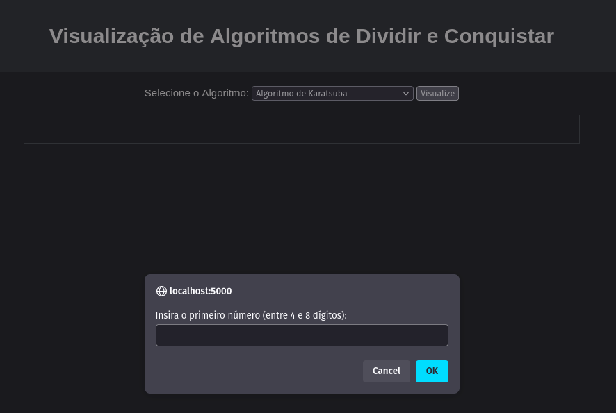
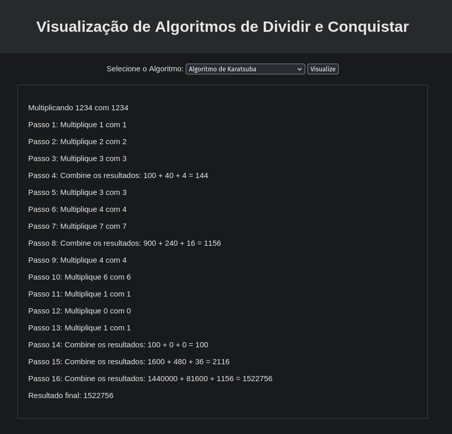
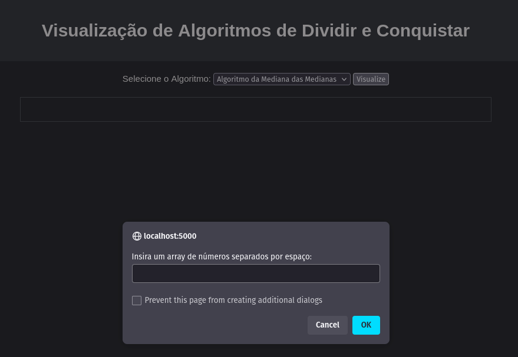
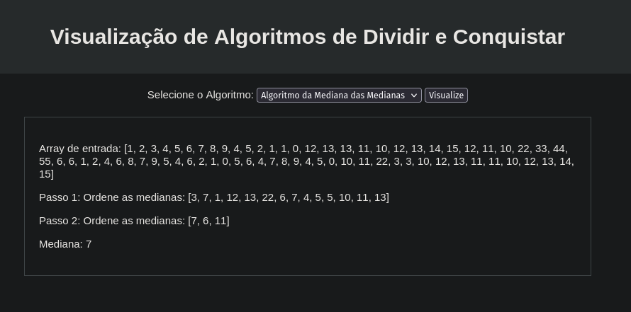

# Divide and Conquer Viewer

**Número da Lista**: x 
**Conteúdo da Disciplina**: Divide and Conquer 

## Alunos
|Matrícula | Aluno |
| -- | -- |
| 190058587  |  Matheus Raphael Soares de Oliveira |

## Sobre 
Projeto web para auxiliar na visualização de alguns algoritmos de **Divide and Conquer**, como o algoritmo da **Multiplicação de Karatsuba** e o algoritmo da **Mediana das Medianas**. 

## Screenshots

## Instalação 
**Linguagem**: Python / JavaScript  
**Framework**: Flask para o pequeno backend  

Deve ser instalado python3 e Flask na sua máquina para rodar o backend. Porém, sendo um backend bem simples, a troca desse pela tecnologia da sua escolha é trivial.

Após instalado Flask e dentro do diretório que contém o arquivo *app.py*, rode o programa com:

    flask run

## Uso 
Entre no site pelo **localhost:5000** e escolha o algoritmo que deseja visualizar, depois apenas siga as instruções dadas pelos prompts.

## Other
BUG:
- Karatsuba: 
    - em algumas ocasiões o algoritmo produz a resposta errada, por causa de algum erro no processo de calcular o $z_1$ que ainda não consegui encontrar